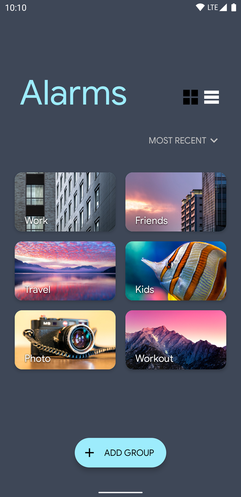
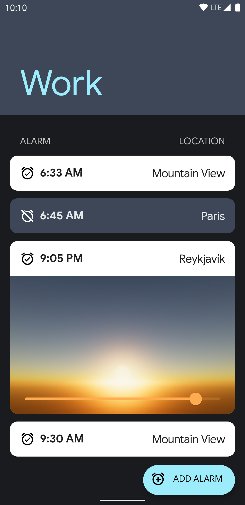

# Wake Me Up

Wake Me Up is a sample app showcased in the
[Google I/O 2021 Developer Keynote](https://youtu.be/D_mVOAXcrtc?t=817) that demonstrates
interoperability between [Jetpack Compose](https://developer.android.com/jetpack/compose) and the
Android UI Toolkit, including fragments, `SurfaceView`, and more.

## How to build

To build this demo, you must first download a copy of
[Filament](https://github.com/google/filament/releases) for your operating system. Make sure to
select a release that matches the version listed in [build.gradle](./build.gradle). The current
release to use is [1.12.8](https://github.com/google/filament/releases/tag/v1.12.8).

After downloading the release, extract is and copy the binary called `matc` (Linux and macOS) or 
`matc.exe` (Windows) into this project's `./filament/bin`. This binary is necessary to compile the
shaders used by this demo.

# Screenshots

## License

All photos licensed under [CC0](https://creativecommons.org/share-your-work/public-domain/cc0/)
and available on [Flickr](https://www.flickr.com/photos/romainguy/).

Licensed under MIT License. Please see [LICENSE](./LICENSE) for more information.
